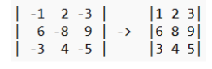
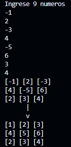
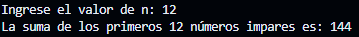
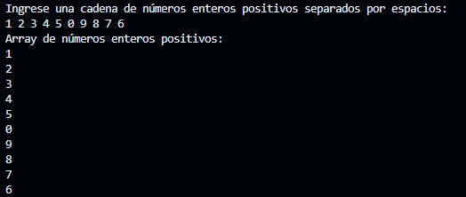
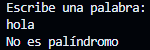
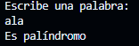
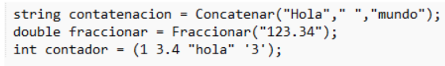
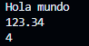

# Taller 1
Entrega de taller 1 de repaso Scripting.

## Ejercicios

### Practicos

1. Recorra una matriz nxm y reemplace los valores negativos por un número positivo, como muestra el ejemplo:



```c#
using System;

  class RecorreReemplazaMatriz
  {
    static void Main(string[] args)
    {
      int[,] matriz = new int[3, 3];  

      Console.WriteLine("Ingrese 9 numeros");

      for(int i = 0; i < 3; i++)
      {
        for(int j = 0; j < 3; j++)
          matriz[i, j] = int.Parse(Console.ReadLine());
      }

      for(int i = 0; i < 3; i++)
      {
        for(int j = 0; j < 3; j++)
        {
          Console.Write("[" + matriz[i, j] + "] ");
          if(j >= 2)
            Console.WriteLine();
        }
      }

      Console.WriteLine("      |");
      Console.WriteLine("      v");

      for(int i = 0; i < 3; i++)
      {
        for(int j = 0; j < 3; j++)
        {
          if(matriz[i, j] < 0)
            matriz[i, j] *= -1;

          Console.Write("[" + matriz[i, j] + "] ");

          if(j >= 2)
            Console.WriteLine();
        }
      }
    }
  }
```

### Salida



6. Usando un ciclo do-while calcule la suma de los primeros n números impares.

```c#
using System;

class ReemplazarNumerosNegativosMatriz
{
    static void Main()
    {
        Console.Write("Ingrese el valor de n: ");
        int n = int.Parse(Console.ReadLine());

        int suma = 0;
        int contador = 0;
        int numeroImpar = 1;

        do
        {
            suma += numeroImpar;
            numeroImpar += 2;
            contador++;
        } while(contador < n);

        Console.WriteLine("La suma de los primeros " + n + " números impares es: " + suma);
    }
}
```

### Salida



7. Lea una cadena de números enteros positivos y luego cree un array con los números de la cadena, se debe validar que la cadena contenga números.

```c#
using System;
using System.Linq;

class ValidarCadenaConNumerosEnteros
{
    static void Main()
    {
        Console.WriteLine("Ingrese una cadena de números enteros positivos separados por espacios:");
        string cadena = Console.ReadLine();

        if (EsNumero(cadena))
        {
            int[] arrNum = cadena.Split(' ').Select(int.Parse).ToArray();

            Console.WriteLine("Array de números enteros positivos:");

            foreach (int num in arrNum)
                Console.WriteLine(num);
        }
        else
            Console.WriteLine("La cadena contiene caracteres no válidos. Solo se permiten números enteros positivos separados por espacios.");
    }

    static bool EsNumero(string cadena)
    {
        foreach (char c in cadena)
        {
            if (!char.IsDigit(c) && c != ' ')
                return false;
        }
        return true;
    }
}
```

### Salida



15. Realizar una función que calcule si una cadena es palindroma.

```c#
using System;

public class ComprobarPalindromoRecursivo
{
    public static void Main(string[] args)
    {
        Console.WriteLine("Escribe una palabra:");
        string texto = Console.ReadLine();
        if (EsPalindromo(texto))
        {
            Console.WriteLine("Es palíndromo");
        }
        else
        {
            Console.WriteLine("No es palíndromo");
        }
    }

    public static bool EsPalindromo(string texto)
    {
        if (texto.Length <= 1)
        {
            return true;
        }
        else
        {
            if (texto[0] != texto[texto.Length - 1])
            {
                return false;
            }
            else
            {
                return EsPalindromo(texto.Substring(1, texto.Length - 2));
            }
        }
    }
}
```

### Salida




16. Realice la implementación de las firmas de las  siguientes invocaciones.



```c#
using System;

public class ImplementarFirmas
{
    public static void Main(string[] args)
    {
        // Invocaciones de ejemplo
        string concatenacion = Concatenar("Hola", " ", "mundo");
        Console.WriteLine(concatenacion);

        double fraccionar = Fraccionar("123.34");
        Console.WriteLine(fraccionar);

        int contador = Contar(1, 3.4, "hola", '3');
        Console.WriteLine(contador);
    }

    public static string Concatenar(string word1, string word2, string word3)
    {
        return word1 + word2 + word3;
    }

    public static double Fraccionar(string numero)
    {
        // Intentar convertir la cadena en un número decimal
        if (double.TryParse(numero, out double valor))
            return valor;
        else
            throw new FormatException("No es un número decimal válido.");
    }

    public static int Contar(params object[] elementos)
    {
        return elementos.Length;
    }
}
```

### Salida



### Teoricos

1. ¿Qué es un ciclo infinito? Escriba un ejemplo

```c#
using System;

class Program
{
    static void Main()
    {
        int i = 0;
        while (true)
        {
            Console.WriteLine($"Valor de i: {i}");
            i++;

            // Añadiendo una pausa para evitar que el ciclo sature la salida
            System.Threading.Thread.Sleep(1000); // Pausa de 1 segundo
        }
    }
}
```

8. Realice un ciclo infinito usando un ciclo for.

```c#
using System;

class Program
{
    static void Main()
    {
        // Ciclo infinito
        for (;;)
        {
            Console.WriteLine("Este es un ciclo infinito");

            // Añadiendo una pausa para evitar que el ciclo sature la salida
            System.Threading.Thread.Sleep(1000); // Pausa de 1 segundo
        }
    }
}
```

## Command Challenge
1. 🐌 Your first challenge is to print "hello world" on the terminal in a single command.

### Respuesta:
```bash
printf "hello world"
```

2. 🦋 Print the current working directory.

### Respuesta:
```bash
pwd
```

pwd = Print Working Directory

3. 🐛 List names of all the files in the current directory, one file per line.

### Respuesta:
```bash
ls
```

4. 🐜 There is a file named access.log in the current directory. Print the contents.

### Respuesta:
```bash
cat access.log
```

cat = concatenate

5. 🕸️ Print the last 5 lines of "access.log".

### Respuesta:
```bash
tail -5 access.log
```

6. 🐳 Create an empty file named take-the-command-challenge in the current working directory.

### Respuesta:
```bash
touch take-the-command-challenge
```

7. 🐋 Create a directory named tmp/files in the current working directory

### Respuesta:
```bash
mkdir -p tmp/files
```

mkdir = make directory

8. 🐬 Copy the file named take-the-command-challenge to the directory tmp/files

### Respuesta:
```bash
cp take-the-command-challenge tmp/files
```

cp = copy

9. 🐟 Move the file named take-the-command-challenge to the directory tmp/files

### Respuesta:
```bash
mv take-the-command-challenge tmp/files
```

mv = move

10. 🐠 Create a symbolic link named take-the-command-challenge that points to the file tmp/files/take-the-command-challenge.

### Respuesta:
```bash
ln -s tmp/files/take-the-command-challenge take-the-command-challenge
```

ln = link

11. 🐡 Delete all of the files in this challenge directory including all subdirectories and their contents.

### Respuesta:
```bash
find . -delete
```

. = carpeta actual

12. 🐺 There are files in this challenge with different file extensions. Remove all files with the .doc extension recursively in the current working directory.

### Respuesta:
```bash
rm -rf **/*.doc
```

rm = remove

-r = elimina todos los archivos y subcarpetas del directorio actual.

-f = fuerza la eliminación de los archivos sin pedir confirmación.

**/ = busca dentro de subcarpetas.

\* = todos los archivos de tipo .doc.

13. 🐝 There is a file named access.log in the current working directory. Print all lines in this file that contains the string "GET".

### Respuesta:
```bash
grep GET access.log
```

grep = global regular expression print


14. 🐞 Print all files in the current directory, one per line (not the path, just the filename) that contain the string "500".

### Respuesta:
```bash
grep -l 500 *
```

-l = muestra el nombre de los archivos.

15. 🦗 Print the relative file paths, one path per line for all filenames that start with "access.log" in the current directory.

### Respuesta:
```bash
ls access.log*
```

16. 🕷️ Print all matching lines (without the filename or the file path) in all files under the current directory that start with "access.log" that contain the string "500".

### Respuesta:
```bash
grep -rh 500
```

-h = muestra la información de manera más legible para los humanos.

17. 🦀 Extract all IP addresses from files that start with "access.log" printing one IP address per line.

### Respuesta:
```bash
grep -ro ^[0-9.]*
```

-o = solo muestra las coincidencias, no la línea en la que se encuentra la coincidencia.

^ = debe ocurrir al principio de la línea.

[0-9.] = la coincidencia puede ser cualquier número o un punto.

\* = acepta más caracteres que coincidan.

18. 🦟 Count the number of files in the current working directory. Print the number of files as a single integer.

### Respuesta:
```bash
ls -l | wc -l
```

| = toma la salida de un comando como entrada de otro comando

wc = word count

19. 🐛 Print the contents of access.log sorted.

### Respuesta:
```bash
sort access.log
```

sort = organiza los datos alfabéticamente o numéricamente en orden ascendente o descendente.

20. 🦠 Print the number of lines in access.log that contain the string "GET".

### Respuesta:
```bash
grep GET access.log | wc -l
```

21. 🐵 The file split-me.txt contains a list of numbers separated by a ; character.

Split the numbers on the ; character, one number per line.

### Respuesta:
```bash
cat split-me.txt | tr ";" "\n"
```

tr = translate

\n = salto de linea

22. 🐶 Print the numbers 1 to 100 separated by spaces.

### Respuesta:
```bash
printf "%d " {1..100}
```
"
"%d " = formato de impresion para numeros enteros.

{1..100} = Genera una secuencia de números del 1 al 100.

23. 🦊 This challenge has text files (with a .txt extension) that contain the phrase "challenges are difficult". Delete this phrase from all text files recursively.

### Respuesta:
```bash
sed -i '/challenges are difficult/d' **/*.txt
```

sed =  edición de texto en línea que se utiliza para modificar archivos.

-i = in-place

/d = elimina el parametro indicado.

24. 🐱 The file sum-me.txt has a list of numbers, one per line. Print the sum of these numbers.

### Respuesta:
```bash
jq -s add *
```

jq = procesa y manipula archivos JSON desde la terminal.

-s = lee todos los archivos JSON proporcionados y los combina.

add = suma o concatena los valores de un arreglo de objetos JSON.

25. 🦁 Print all files in the current directory recursively without the leading directory path.

### Respuesta:
```bash
find . -type f -printf "%f\n"
```
-type f = solo busca archivos regulares.

%f = muestra el nombre del archivo.

26. 🐯 Rename all files removing the extension from them in the current directory recursively.

### Respuesta:
```bash
mv * .*
```

27. 🐴 The files in this challenge contain spaces. List all of the files (filenames only) in the current directory but replace all spaces with a '.' character.

### Respuesta:
```bash
ls | tr ' ' '.'
```

28. 🦄 In this challenge there are some directories containing files with different extensions. Print all directories, one per line without duplicates that contain one or more files with a ".tf" extension.

### Respuesta:
```bash
dirname **/*tf | sort -u
```

dirname = extrae la ruta del directorio de una ruta de archivo determinada.

**/*tf = archivos que su nombre terminen en tf.

-u = único. No aparecen archivos repetidos en la salida.

29. 🐮 There are a mix of files in this directory that start with letters and numbers. Print the filenames (just the filenames) of all files that start with a number recursively in the current directory.

### Respuesta:
```bash
find -type f -printf '%f\n' | grep ^[0-9]
```

30. 🐷 Print the 25th line of the file faces.txt

### Respuesta:
```bash
cat faces.txt | head -25 | tail -1
```

31. 🐭 Print the lines of the file reverse-me.txt in this directory in reverse line order so that the last line is printed first and the first line is printed last.

### Respuesta:
```bash
tac *
```

tac = concatena e imprime los archivos en formato inverso.

32. 🐹 Print the file faces.txt, but only print the first instance of each duplicate line, even if the duplicates don't appear next to each other.

### Respuesta:
```bash
cat -n faces.txt | sort -u -k 2 | sort -n | cut -f 2
```

-n = numerará las líneas del archivo.

-k 2 = ordena las líneas usando el segundo campo.

33. 🐻 The file random-numbers.txt contains a list of 100 random integers. Print the number of unique prime numbers contained in the file.

### Respuesta:
```bash
cat random-numbers.txt | sort| uniq | factor | awk 'NF==2'| wc -l
```

uniq =  elimina las líneas repetidas en su entrada.

factor = descompone un número en sus factores primos.

awk 'NF==2' = solo pasa las líneas que tienen exactamente dos campos.

34. 🐼 Print the IP addresses common to both files, one per line.

### Respuesta:
```bash
cat access.log.* | awk '{print $1}' | sort | uniq -d
```

-d = muestra las líneas que se repiten.

35. 🐣 Print all matching lines (without the filename or the file path) in all files under the current directory that start with "access.log", where the next line contains the string "404".

### Respuesta:
```bash
awk '/404/{print x}{x=$0}' **/access.log*
```

36. 🦚 Print all files with a .bin extension in the current directory that are different than the file named base.bin.

### Respuesta:
```bash
ls *.bin | while read file; do cmp -s base.bin $file || echo $file; done
```

cmp = compara archivos byte por byte.

37. 🐸 There is a file: ./.../ /. .the flag.txt

Show its contents on the screen.

### Respuesta:
```bash
find -type f -name '*flag*' -exec cat '{}' \;
```

-exec = ejecuta un comando sobre los archivos que cumplen con los criterios especificados anteriormente.

38. 🐲 How many lines contain tab characters in the file named file-with-tabs.txt in the current directory.

### Respuesta:
```bash
grep -c $'\t' file-with-tabs.txt
```

-c = cuente el número de líneas que coinciden con el patrón.

$'\t' = representa el tab.

39. 🌺 There are files in this challenge with different file extensions.

Remove all files without the .txt and .exe extensions recursively in the current working directory.

### Respuesta:
```bash
find -type f ! -name \*.txt ! -name \*.exe -exec rm -v '{}' \;
```

! = niega el siguiente comando.

rm -v  '{}' \ = elimina los archivos encontrados y que muestre el nombre del archivo.

40. 🌹 There are some files in this directory that start with a dash in the filename. Remove those files.

### Respuesta:
```bash
rm ./-*
```

41. 🌷 There are two files in this directory, ps-ef1 and ps-ef2. Print the contents of both files sorted by PID and delete repeated lines.

### Respuesta:
```bash
cat ps-* | sort -k2 -n |uniq
```

42. 🌻 In the current directory there is a file called netstat.out.

Print all the IPv4 listening ports sorted from the higher to lower.

### Respuesta:
```bash
awk '/tcp .*LISTEN$/{print $4}' netstat*|awk -F: '{print $2}'|sort -nr
```
#


## 20 firmas diferentes

### 1. 
```c#
int Sumar(int a, int b)
{
    return a + b;
}

int resultado = Sumar(1, 2);
Console.WriteLine(resultado);
```

### 2. 
```c#
void Aumento(ref int valor)
{
    valor++;
}

int numero = 5;
Aumento(ref numero);
Console.WriteLine(numero);
```

### 3. 
```c#
void ComprobarEdad(int edad)
{
    if (edad < 18)
        Console.WriteLine("Menor de edad");
    else
        Console.WriteLine("Adulto");
}

ComprobarEdad(15);
ComprobarEdad(22);
```

### 4. 
```c#
void AplicarOperacion(int[] numeros, Func<int, int> operacion)
{
    foreach (var numero in numeros)
    {
        Console.WriteLine(operacion(numero));
    }
}

int[] nums = { 1, 2, 3, 4, 5 };
AplicarOperacion(nums, x => x * x);
```

### 5. 
```c#
IEnumerable<int> FiltrarPares(IEnumerable<int> numerosp)
{
    return numerosp.Where(x => x % 2 == 0);
}

var pares = FiltrarPares(new List<int> { 1, 2, 3, 4, 5 });
foreach (var numerop in pares)
{
    Console.WriteLine(numerop);
}
```

### 6. 
```c#
void Escribir()
{
    Console.WriteLine("Mondongo");
}

Escribir();
```

### 7. 
```c#
string CrearMensaje(string saludo, string nombre)
{
    return $"{saludo}, {nombre}!";
}

string mensaje = CrearMensaje(saludo: "Hola", nombre: "Emanuel");
Console.WriteLine(mensaje);
```

### 8. 
```c#
List<int> ListaNumeros()
{
    return new List<int> { 1, 2, 3, 4, 5 };
}

List<int> miLista = ListaNumeros();
miLista.ForEach(Console.WriteLine);
```

### 9. 
```c#
int Factorial(int n)
{
    if (n == 0)
    {
        return 1;
    }
    else
    {
        return n * Factorial(n - 1);
    }
}

int resultadoFactorial = Factorial(5);
Console.WriteLine(resultadoFactorial);
```

### 10. 
```c#
void MostrarParametros(params object[] parametros)
{
    foreach (var parametro in parametros)
    {
        Console.WriteLine(parametro);
    }
}

MostrarParametros(1, "texto", 3.14, true);
```

### 11. 
```c#
static double CalcularArea(double radio)
{
    const double Pi = 3.141592653589793;
    double area = Pi * rado * radio;
    return area;
}

double radio = 5.0;
double area = CalcularArea(radio);
Console.WriteLine($"El área del círculo con radio {radio} es: {area}");
```

### 12. 
```c#
bool EsPar(int num)
{
    return num % 2 == 0;
}

int num = 4;
bool esPar = EsPar(num);
Console.WriteLine($"El número {num} es par: {esPar}");
```

### 13. 
```c#
float CalcularVelocidad(float distancia, float tiempo)
{
    if (tiempo == 0)
    {
        throw new ArgumentException("El tiempo no puede ser cero.");
    }

    return distancia / tiempo;
}

float distancia = 100.0f; 
float tiempo = 9.58f; 

float velocidad = CalcularVelocidad(distancia, tiempo);
Console.WriteLine($"La velocidad es: {velocidad} m/s");
```

### 14. 
```c#
string ObtenerRgbHex(byte red, byte green, byte blue)
{
    return $"#{red:X2}{green:X2}{blue:X2}";
}

byte red = 255;
byte green = 100;
byte blue = 50;

string rgbHex = ObtenerRgbHex(red, green, blue);

Console.WriteLine($"El código RGB en formato hexadecimal es: {rgbHex}");   
```

### 15. 
```c#
public class Person
{
    public string Name { get; set; }
    public int Age { get; set; }

    public Person(string name, int age)
    {
        Name = name;
        Age = age;
    }

    Person person = CreatePerson("Juan Pérez", 30);

    Console.WriteLine($"Nombre: {person.Name}");
    Console.WriteLine($"Edad: {person.Age}");
}

static Person CreatePerson(string name, int age)
{
    return new Person(name, age);
}
```

### 16. 
```c#
static Dictionary<int, string> ObtenerDepartamentosDeEmpleados()
{
    return new Dictionary<int, string>
    {
        { 101, "Ventas" },
        { 102, "Marketing" },
        { 103, "Recursos Humanos" },
        { 104, "TI" }
    };
}

Dictionary<int, string> departamentoDeEmpleados = ObtenerDepartamentosDeEmpleados();

Console.WriteLine("Empleados y sus departamentos:");

foreach (var pair in departamentoDeEmpleados)
{
    Console.WriteLine($"ID Empleado: {pair.Key}, Departamento: {pair.Value}");
}
```

### 17. 
```c#
static void LogError(Exception ex)
{
    Console.WriteLine("Se ha producido un error:");
    Console.WriteLine($"Mensaje: {ex.Message}");
    Console.WriteLine($"Pila de llamadas: {ex.StackTrace}");
}

try
{
    throw new InvalidOperationException("Se ha producido un error inesperado.");
}
catch (Exception ex)
{
    LogError(ex);
}   
```

### 18. 
```c#
static void ImprimirStack(Stack<int> stack)
{
    foreach (int value in stack)
    {
        Console.WriteLine(value);
    }
}

Stack<int> stack = new Stack<int>();

stack.Push(1);
stack.Push(2);
stack.Push(3);
stack.Push(4);
stack.Push(5);

Console.WriteLine("Contenido original de la pila:");
PrintStack(stack);
```

### 19. 
```c#
static void AddAndProcessQueue(Queue<int> queue)
{
    queue.Enqueue(10);
    queue.Enqueue(20);
    queue.Enqueue(30);

    Console.WriteLine("Procesando elementos de la cola:");
    while (queue.Count > 0)
    {
        int item = queue.Dequeue(); 
        Console.WriteLine(item);    
    }
}

static void PrintQueue(Queue<int> queue)
{
    if (queue.Count == 0)
    {
        Console.WriteLine("La cola está vacía.");
    }
    else
    {
        foreach (int value in queue)
        {
            Console.WriteLine(value);
        }
    }
}

Queue<int> queue = new Queue<int>();

AddAndProcessQueue(queue);

Console.WriteLine("\nContenido de la cola después del procesamiento (debería estar vacío):");
PrintQueue(queue);
```

### 20. 
```c#
static T EncontrarMaximo<T>(T[] items) where T : IComparable<T>
{
    if (items == null || items.Length == 0)
    {
        throw new ArgumentException("El arreglo no puede ser nulo o vacío.");
    }

    T max = items[0]; // Inicializar el valor máximo con el primer elemento

    foreach (T item in items)
    {
        if (item.CompareTo(max) > 0)
        {
            max = item; // Actualizar el valor máximo
        }
    }

    return max;
}

int[] intArray = { 3, 7, 1, 9, 5 };
int maxInt = EncontrarMaximo(intArray);
Console.WriteLine($"El valor máximo en el arreglo de enteros es: {maxInt}");

string[] stringArray = { "apple", "banana", "cherry" };
string maxString = EncontrarMaximo(stringArray);
Console.WriteLine($"El valor máximo en el arreglo de cadenas es: {maxString}");
```

## Conclusiones

1. Practicar la lógica ayuda a mejorar la capacidad de análisis y síntesis, esenciales para resolver problemas de programación.

2. Comprender conceptos teóricos como estructuras de datos, algoritmos y principios de diseño de software permite a los programadores que su código sea actualizable, escalable y comprensible para otros desarrolladores.

3. Las buenas prácticas, como el uso de comentarios claros, la escritura de código limpio y correcta nomenclatura, mejoran la legibilidad y mantenibilidad del código. 

